# NotePad
## 一、项目概述
### 本项目是基于Android平台的增强版笔记管理应用，在原生NotePad应用基础上扩展了多项实用功能。  
### 初始应用的功能：   
新建笔记和编辑笔记  
编辑标题  
笔记列表  
### 扩展功能： 
时间戳显示  
笔记搜索（实时搜索、高亮显示、搜索历史）  
笔记分类  
笔记便签（桌面小部件）   
### 技术栈：   
Android SDK、SQLite、ContentProvider、AppWidget
## 二、扩展必做功能说明  
### （一）笔记条目增加时间戳显示  
#### 1.功能要求
每个新建笔记都会保存创建时间并显示在笔记列表中  
修改笔记后，笔记列表中的时间戳更新为最后修改时间  
仅在实际内容修改时才更新时间戳，**仅查看笔记不影响时间戳**    

#### 2.实现思路和技术实现
(1) 布局修改 - noteslist_item.xml  
将原有的单个TextView改为垂直LinearLayout，添加第二个TextView用于显示时间戳：

```xml
<LinearLayout xmlns:android="http://schemas.android.com/apk/res/android"
    android:layout_width="match_parent"
    android:layout_height="wrap_content"
    android:orientation="vertical"
    android:padding="12dp">

    <!-- 标题 -->
    <TextView
        android:id="@android:id/text1"
        android:layout_width="match_parent"
        android:layout_height="wrap_content"
        android:textSize="16sp"
        android:textColor="@color/text_primary"
        android:textStyle="bold"
        android:singleLine="true"
        android:ellipsize="end" />

    <!-- 时间戳 -->
    <TextView
        android:id="@+id/text2"
        android:layout_width="match_parent"
        android:layout_height="wrap_content"
        android:textSize="12sp"
        android:textColor="@color/text_secondary"
        android:paddingTop="4dp" />

</LinearLayout>
```
(2) 数据查询扩展 - NotesList.java  
扩展PROJECTION数组以包含时间戳字段：   
```java
private static final String[] PROJECTION = new String[] {
    NotePad.Notes._ID,                    // 0
    NotePad.Notes.COLUMN_NAME_TITLE,      // 1
    NotePad.Notes.COLUMN_NAME_MODIFICATION_DATE, // 2 - 新增时间戳字段
    NotePad.Notes.COLUMN_NAME_CATEGORY,   // 3 - 分类字段
    NotePad.Notes.COLUMN_NAME_NOTE,       // 4 - 笔记内容（用于搜索）
};

private static final int COLUMN_INDEX_MODIFICATION_DATE = 2;
```
(3) 适配器配置  
更新数据映射以包含时间戳字段：  
```java
String[] dataColumns = { 
    NotePad.Notes.COLUMN_NAME_TITLE,
    NotePad.Notes.COLUMN_NAME_MODIFICATION_DATE 
};

int[] viewIDs = { 
    android.R.id.text1, 
    R.id.text2 
};

// 使用自定义适配器绑定数据
public void bindView(View view, Context context, Cursor cursor) {
    TextView titleView = view.findViewById(android.R.id.text1);
    TextView timestampView = view.findViewById(R.id.text2);
    
    String title = cursor.getString(COLUMN_INDEX_TITLE);
    long timestamp = cursor.getLong(COLUMN_INDEX_MODIFICATION_DATE);
    
    titleView.setText(title);
    timestampView.setText(formatTimestamp(timestamp)); // 格式化时间戳
}
```
(4) 时间戳格式化  
将长整型时间戳转换为易读的日期时间格式：  
```java
private String formatTimestamp(long timestamp) {
    if (timestamp == 0) {
        return "Unknown time";
    }
    
    Date date = new Date(timestamp);
    java.text.DateFormat dateFormat = DateFormat.getDateFormat(this);
    java.text.DateFormat timeFormat = DateFormat.getTimeFormat(this);
    
    return dateFormat.format(date) + " " + timeFormat.format(date);
}
```
(5) 修复时间戳误更新问题  
在笔记编辑器中添加内容比较逻辑，仅在实际修改时才更新时间戳：  
```java
@Override
protected void onPause() {
    super.onPause();
    
    if (mCursor != null) {
        String text = mText.getText().toString();
        int colNoteIndex = mCursor.getColumnIndex(NotePad.Notes.COLUMN_NAME_NOTE);
        String originalNote = mCursor.getString(colNoteIndex);
        
        // 只有内容实际发生变化时才更新时间戳
        if (!text.equals(originalNote)) {
            updateNote(text, null); // 这会更新时间戳
        }
    }
}
```
#### 3. 实现效果界面截图
（1）创建笔记显示创建时间  
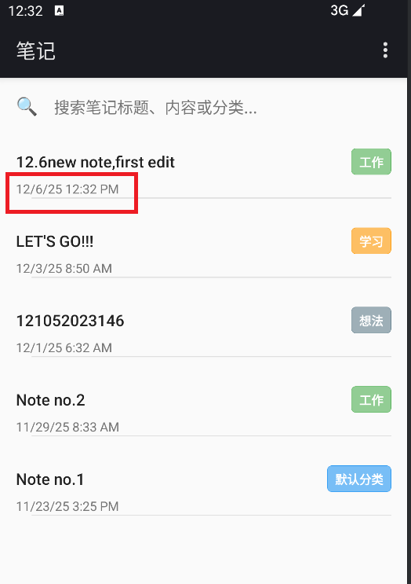  
（2）修改笔记后更新时间戳  
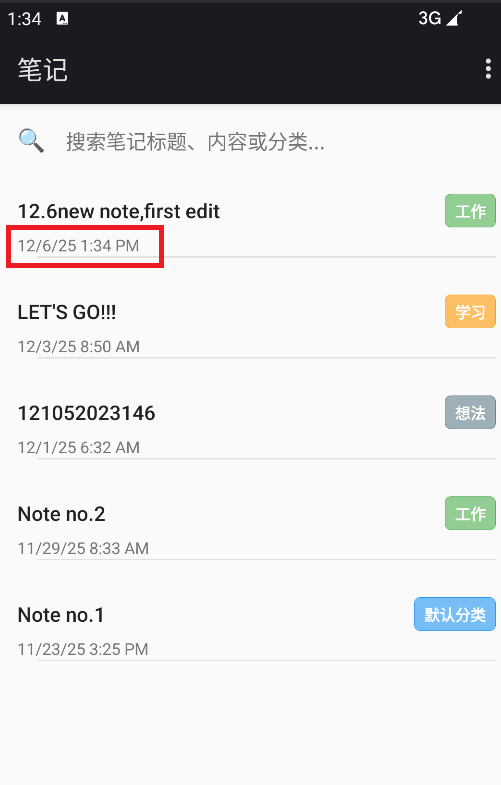

### （二）笔记搜索功能（实时搜索、高亮显示、搜索历史）
#### 1. 功能要求
实时搜索：在搜索框中输入时实时过滤笔记列表，支持防抖机制  
多字段搜索：同时搜索标题、内容和分类  
高级搜索选项：可配置搜索范围（标题/内容）、大小写敏感、全词匹配  
搜索高亮：在搜索结果中高亮显示匹配的关键词  
搜索历史：保存最近搜索记录，支持快速重搜和历史管理  

#### 2.实现思路和技术实现
(1) 搜索界面布局 - notes_list.xml  
在主界面顶部集成搜索框，无需跳转到单独搜索页面：  
```xml
<LinearLayout
    android:layout_width="match_parent"
    android:layout_height="wrap_content"
    android:orientation="horizontal"
    android:background="@color/background_light"
    android:padding="8dp">

    <!-- 搜索图标 -->
    <TextView
        android:layout_width="wrap_content"
        android:layout_height="wrap_content"
        android:text="🔍"
        android:textSize="18sp"
        android:padding="8dp" />

    <!-- 搜索输入框 -->
    <EditText
        android:id="@+id/search_edit_text"
        android:layout_width="0dp"
        android:layout_height="wrap_content"
        android:layout_weight="1"
        android:hint="搜索笔记标题、内容或分类..."
        android:singleLine="true"
        android:imeOptions="actionSearch" />

    <!-- 清除按钮 -->
    <TextView
        android:id="@+id/search_clear_button"
        android:layout_width="wrap_content"
        android:layout_height="wrap_content"
        android:text="×"
        android:textSize="24sp"
        android:visibility="gone"
        android:padding="8dp" />
</LinearLayout>
```
(2) 实时搜索实现 - NotesList.java  
实现带防抖机制的实时搜索功能：  
```java
private Handler mSearchHandler = new Handler();
private static final int SEARCH_DELAY_MS = 300; // 300毫秒防抖延迟
private Runnable mSearchRunnable;

private void performRealTimeSearch(String query, boolean immediate) {
    // 取消之前的搜索任务
    if (mSearchRunnable != null) {
        mSearchHandler.removeCallbacks(mSearchRunnable);
    }
    
    final String searchQuery = query.trim();
    
    // 创建新的搜索任务
    mSearchRunnable = new Runnable() {
        @Override
        public void run() {
            executeSearch(searchQuery);
        }
    };
    
    // 根据情况设置延迟或立即执行
    if (immediate) {
        mSearchHandler.post(mSearchRunnable); // 用户提交，立即执行
    } else {
        mSearchHandler.postDelayed(mSearchRunnable, SEARCH_DELAY_MS); // 防抖延迟
    }
}
```
(3) 高级搜索条件构建  
支持复杂的搜索条件组合：  
```java
private String buildAdvancedSearchCondition() {
    List<String> conditions = new ArrayList<>();
    String searchPattern = mCurrentSearchQuery;
    
    // 处理大小写敏感
    if (!mCaseSensitive) {
        searchPattern = searchPattern.toLowerCase();
    }
    
    // 构建搜索模式
    String likePattern = "%" + searchPattern + "%";
    
    // 添加标题搜索条件
    if (mSearchInTitle) {
        if (mCaseSensitive) {
            conditions.add(NotePad.Notes.COLUMN_NAME_TITLE + " LIKE ?");
        } else {
            conditions.add("LOWER(" + NotePad.Notes.COLUMN_NAME_TITLE + ") LIKE ?");
        }
    }
    
    // 添加内容搜索条件
    if (mSearchInContent) {
        if (mCaseSensitive) {
            conditions.add(NotePad.Notes.COLUMN_NAME_NOTE + " LIKE ?");
        } else {
            conditions.add("LOWER(" + NotePad.Notes.COLUMN_NAME_NOTE + ") LIKE ?");
        }
    }
    
    // 组合条件
    if (conditions.size() == 1) {
        return conditions.get(0);
    } else {
        StringBuilder sb = new StringBuilder("(");
        for (int i = 0; i < conditions.size(); i++) {
            if (i > 0) sb.append(" OR ");
            sb.append(conditions.get(i));
        }
        sb.append(")");
        return sb.toString();
    }
}
```
(4) 搜索高亮显示  
在适配器中实现多关键词高亮：  
```java
private void highlightSearchText(TextView textView, String text, String searchQuery, boolean isTitle) {
    if (TextUtils.isEmpty(text) || TextUtils.isEmpty(searchQuery)) {
        textView.setText(text);
        return;
    }
    
    SpannableString spannable = new SpannableString(text);
    String lowerText = mCaseSensitive ? text : text.toLowerCase();
    String lowerQuery = mCaseSensitive ? searchQuery : searchQuery.toLowerCase();
    
    // 分割搜索词（支持多个关键词，用空格分隔）
    String[] keywords = searchQuery.split("\\s+");
    
    for (String keyword : keywords) {
        String lowerKeyword = mCaseSensitive ? keyword : keyword.toLowerCase();
        int startIndex = 0;
        
        while ((startIndex = lowerText.indexOf(lowerKeyword, startIndex)) != -1) {
            int endIndex = startIndex + keyword.length();
            
            // 设置不同的高亮颜色
            int highlightColor = isTitle ? 0x80FFEB3B : 0x8003A9F4;
            
            spannable.setSpan(
                new BackgroundColorSpan(highlightColor),
                startIndex, endIndex,
                Spannable.SPAN_EXCLUSIVE_EXCLUSIVE
            );
            
            // 加粗匹配的文本
            spannable.setSpan(
                new StyleSpan(Typeface.BOLD),
                startIndex, endIndex,
                Spannable.SPAN_EXCLUSIVE_EXCLUSIVE
            );
            
            startIndex = endIndex;
        }
    }
    
    textView.setText(spannable);
}
```
(5) 搜索历史数据库 - NotePadProvider.java  
创建搜索历史表并实现CRUD操作：  
```java
// 数据库版本升级4，支持搜索历史
private static final int DATABASE_VERSION = 4

// 在DatabaseHelper的onCreate方法中创建搜索历史表
db.execSQL("CREATE TABLE " + NotePad.SearchHistory.TABLE_NAME + " ("
        + NotePad.SearchHistory._ID + " INTEGER PRIMARY KEY,"
        + NotePad.SearchHistory.COLUMN_NAME_QUERY + " TEXT UNIQUE,"
        + NotePad.SearchHistory.COLUMN_NAME_TIMESTAMP + " INTEGER,"
        + NotePad.SearchHistory.COLUMN_NAME_RESULT_COUNT + " INTEGER DEFAULT 0"
        + ");");
```
(6) 搜索历史管理 - SearchHistoryManager.java  
封装搜索历史的保存、读取和管理功能：  
```java
public class SearchHistoryManager {
    private static final int MAX_HISTORY_ITEMS = 20;
    
    public void saveSearchQuery(String query, int resultCount) {
        ContentValues values = new ContentValues();
        values.put(NotePad.SearchHistory.COLUMN_NAME_QUERY, query);
        values.put(NotePad.SearchHistory.COLUMN_NAME_RESULT_COUNT, resultCount);
        values.put(NotePad.SearchHistory.COLUMN_NAME_TIMESTAMP, System.currentTimeMillis());
        
        // 使用INSERT OR REPLACE策略
        mContentResolver.insertWithOnConflict(
            NotePad.SearchHistory.CONTENT_URI,
            null,
            values,
            SQLiteDatabase.CONFLICT_REPLACE
        );
        
        cleanupOldHistory(); // 清理过期的历史记录
    }
    
    public List<SearchHistoryItem> getSearchHistory() {
        List<SearchHistoryItem> historyList = new ArrayList<>();
        Cursor cursor = mContentResolver.query(
            NotePad.SearchHistory.CONTENT_URI,
            new String[] { NotePad.SearchHistory._ID,
                          NotePad.SearchHistory.COLUMN_NAME_QUERY,
                          NotePad.SearchHistory.COLUMN_NAME_TIMESTAMP,
                          NotePad.SearchHistory.COLUMN_NAME_RESULT_COUNT },
            null, null,
            NotePad.SearchHistory.DEFAULT_SORT_ORDER
        );
        
        // ... 处理cursor数据
        return historyList;
    }
}
```
(7) 高级搜索选项对话框  
提供可配置的搜索选项：  
```java
private void showAdvancedSearchOptions() {
    AlertDialog.Builder builder = new AlertDialog.Builder(this);
    builder.setTitle("高级搜索选项");
    
    LinearLayout layout = new LinearLayout(this);
    layout.setOrientation(LinearLayout.VERTICAL);
    layout.setPadding(20, 20, 20, 20);
    
    // 标题搜索复选框
    final CheckBox titleCheckBox = new CheckBox(this);
    titleCheckBox.setText("搜索标题");
    titleCheckBox.setChecked(mSearchInTitle);
    layout.addView(titleCheckBox);
    
    // 内容搜索复选框
    final CheckBox contentCheckBox = new CheckBox(this);
    contentCheckBox.setText("搜索内容");
    contentCheckBox.setChecked(mSearchInContent);
    layout.addView(contentCheckBox);
    
    // 大小写敏感复选框
    final CheckBox caseCheckBox = new CheckBox(this);
    caseCheckBox.setText("区分大小写");
    caseCheckBox.setChecked(mCaseSensitive);
    layout.addView(caseCheckBox);
    
    // 全词匹配复选框
    final CheckBox wordCheckBox = new CheckBox(this);
    wordCheckBox.setText("全词匹配");
    wordCheckBox.setChecked(mWholeWord);
    layout.addView(wordCheckBox);
    
    builder.setView(layout);
    
    builder.setPositiveButton("应用", new DialogInterface.OnClickListener() {
        @Override
        public void onClick(DialogInterface dialog, int which) {
            // 保存设置并重新搜索
            mSearchInTitle = titleCheckBox.isChecked();
            mSearchInContent = contentCheckBox.isChecked();
            mCaseSensitive = caseCheckBox.isChecked();
            mWholeWord = wordCheckBox.isChecked();
            
            if (!TextUtils.isEmpty(mCurrentSearchQuery)) {
                executeSearch(mCurrentSearchQuery);
            }
        }
    });
    
    builder.show();
}
```
#### 3.实现效果界面截图
（1）实时搜索界面1  
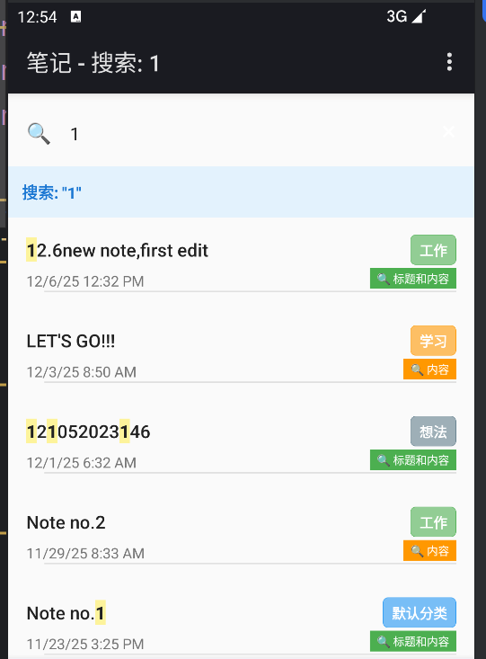  
（2）实时搜索界面2   
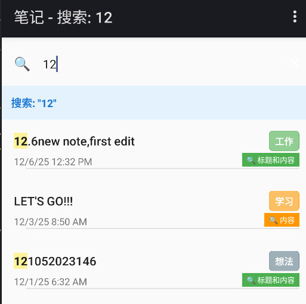   
（3）搜索历史  
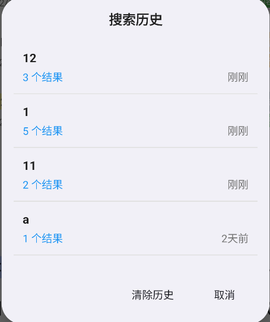  
（4）高级搜索对话框  
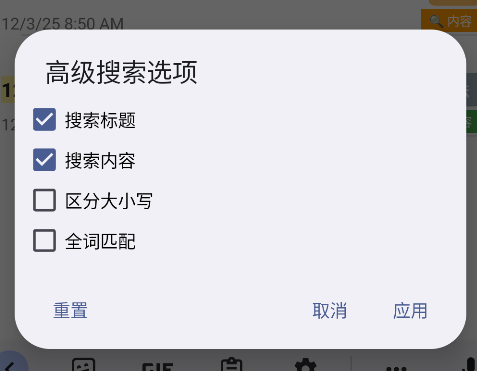  

## 三、扩展选做功能说明
### （一）笔记分类管理
#### 1.功能要求
分类创建与管理：支持创建、编辑、删除分类  
分类分配：为笔记分配分类，编辑时可更改分类  
分类筛选：按分类筛选查看笔记  
分类显示：在主界面显示分类标签，不同分类用不同颜色标识  
颜色管理：为分类分配颜色，在列表中直观显示  
#### 2.实现思路和技术实现
(1) 数据库升级 - NotePadProvider.java  
升级数据库版本，添加分类表和字段：  
```java
// 数据库版本升级到3，支持分类功能
private static final int DATABASE_VERSION = 3;

// 在onCreate方法中创建分类表
db.execSQL("CREATE TABLE " + NotePad.Categories.TABLE_NAME + " ("
        + NotePad.Categories._ID + " INTEGER PRIMARY KEY,"
        + NotePad.Categories.COLUMN_NAME_NAME + " TEXT UNIQUE,"
        + NotePad.Categories.COLUMN_NAME_COLOR + " INTEGER,"
        + NotePad.Categories.COLUMN_NAME_CREATE_DATE + " INTEGER"
        + ");");

// 在笔记表中添加分类字段
db.execSQL("ALTER TABLE " + NotePad.Notes.TABLE_NAME +
          " ADD COLUMN " + NotePad.Notes.COLUMN_NAME_CATEGORY + " TEXT DEFAULT '默认分类'");

// 插入默认分类
private void insertDefaultCategories(SQLiteDatabase db) {
    String[] defaultCategories = {"默认分类", "工作", "学习", "生活", "想法", "购物清单"};
    int[] colors = {0xFF2196F3, 0xFF4CAF50, 0xFFFF9800, 0xFF9C27B0, 0xFF607D8B, 0xFFFF5722};
    
    for (int i = 0; i < defaultCategories.length; i++) {
        ContentValues values = new ContentValues();
        values.put(NotePad.Categories.COLUMN_NAME_NAME, defaultCategories[i]);
        values.put(NotePad.Categories.COLUMN_NAME_COLOR, colors[i]);
        values.put(NotePad.Categories.COLUMN_NAME_CREATE_DATE, System.currentTimeMillis());
        db.insert(NotePad.Categories.TABLE_NAME, null, values);
    }
}
```
(2) 分类颜色映射管理 - NotesList.java  
维护分类与颜色的映射关系：  
```java
private static final Map<String, Integer> CATEGORY_COLORS = new HashMap<String, Integer>();
static {
    CATEGORY_COLORS.put("默认分类", 0xFF2196F3);
    CATEGORY_COLORS.put("工作", 0xFF4CAF50);
    CATEGORY_COLORS.put("学习", 0xFFFF9800);
    CATEGORY_COLORS.put("生活", 0xFF9C27B0);
    CATEGORY_COLORS.put("想法", 0xFF607D8B);
    CATEGORY_COLORS.put("购物清单", 0xFFFF5722);
}
```
(3) 笔记编辑界面分类选择 - note_editor.xml  
在编辑界面添加分类下拉选择器：  
```xml
<LinearLayout
    android:layout_width="match_parent"
    android:layout_height="wrap_content"
    android:orientation="horizontal"
    android:padding="8dp"
    android:background="@color/background_light"
    android:gravity="center_vertical">

    <TextView
        android:layout_width="wrap_content"
        android:layout_height="wrap_content"
        android:text="分类:"
        android:textSize="14sp"
        android:textColor="@color/text_primary" />

    <Spinner
        android:id="@+id/category_spinner"
        android:layout_width="0dp"
        android:layout_height="wrap_content"
        android:layout_weight="1"
        android:padding="8dp" />
</LinearLayout>
```
(4) 分类数据加载 - NoteEditor.java  
动态加载分类列表并设置选择器：  
```java
private void setupCategorySpinner() {
    // 从数据库加载分类列表
    List<String> categories = loadCategories();
    
    ArrayAdapter<String> adapter = new ArrayAdapter<String>(
        this,
        android.R.layout.simple_spinner_item,
        categories
    );
    adapter.setDropDownViewResource(android.R.layout.simple_spinner_dropdown_item);
    
    mCategorySpinner.setAdapter(adapter);
    
    // 设置选择监听器
    mCategorySpinner.setOnItemSelectedListener(new AdapterView.OnItemSelectedListener() {
        @Override
        public void onItemSelected(AdapterView<?> parent, View view, int position, long id) {
            mCurrentCategory = (String) parent.getItemAtPosition(position);
        }
        
        @Override
        public void onNothingSelected(AdapterView<?> parent) {
            mCurrentCategory = "默认分类";
        }
    });
    
    // 设置当前分类
    if (mState == STATE_EDIT && mCursor != null && mCursor.moveToFirst()) {
        String currentCategory = mCursor.getString(
            mCursor.getColumnIndex(NotePad.Notes.COLUMN_NAME_CATEGORY)
        );
        setSpinnerSelection(mCategorySpinner, currentCategory);
    }
}
```
(5) 分类标签显示 - noteslist_item.xml  
在笔记列表项中添加分类标签：  
```xml
<LinearLayout
    android:layout_width="match_parent"
    android:layout_height="0dp"
    android:layout_weight="1"
    android:orientation="horizontal"
    android:gravity="center_vertical">

    <!-- 标题 -->
    <TextView
        android:id="@android:id/text1"
        android:layout_width="0dp"
        android:layout_height="wrap_content"
        android:layout_weight="1"
        android:textColor="@color/text_primary"
        android:textSize="16sp"
        android:singleLine="true"
        android:ellipsize="end" />

    <!-- 分类标签 -->
    <TextView
        android:id="@+id/category_label"
        android:layout_width="wrap_content"
        android:layout_height="wrap_content"
        android:textSize="12sp"
        android:padding="4dp 8dp"
        android:layout_marginStart="8dp"
        android:singleLine="true"
        android:ellipsize="end"
        android:textColor="@android:color/white"
        android:gravity="center" />
</LinearLayout>
```
(6) 分类标签样式设置 - NotesList.java  
根据分类设置不同的颜色样式  
```java
public void bindView(View view, Context context, Cursor cursor) {
    TextView categoryView = view.findViewById(R.id.category_label);
    String category = cursor.getString(COLUMN_INDEX_CATEGORY);
    categoryView.setText(category);
    
    // 获取分类对应的颜色
    Integer categoryColor = CATEGORY_COLORS.get(category);
    if (categoryColor != null) {
        // 创建带圆角的背景
        GradientDrawable drawable = new GradientDrawable();
        int alphaColor = (categoryColor & 0x00FFFFFF) | 0x99000000; // 60%透明度
        drawable.setColor(alphaColor);
        drawable.setCornerRadius(12); // 12dp圆角
        drawable.setStroke(1, categoryColor); // 边框
        
        categoryView.setBackground(drawable);
        categoryView.setTextColor(Color.WHITE);
    }
}
```
(7) 分类筛选功能  
实现按分类筛选笔记列表：  
```java
private void applyFilter(String category) {
    mCurrentFilterCategory = category;
    refreshNotesList(); // 刷新列表
    
    // 在查询条件中添加分类筛选
    String selection = NotePad.Notes.COLUMN_NAME_CATEGORY + " = ?";
    String[] selectionArgs = { category };
    
    Cursor cursor = getContentResolver().query(
        getIntent().getData(),
        PROJECTION,
        selection,
        selectionArgs,
        NotePad.Notes.DEFAULT_SORT_ORDER
    );
    
    // 更新适配器数据
    Cursor oldCursor = mAdapter.swapCursor(cursor);
    if (oldCursor != null) {
        oldCursor.close();
    }
}
```
(8) 分类管理对话框 - category_dialog.xml  
提供完整的分类管理界面：  
```xml
<LinearLayout xmlns:android="http://schemas.android.com/apk/res/android"
    android:layout_width="match_parent"
    android:layout_height="wrap_content"
    android:orientation="vertical"
    android:padding="16dp">

    <!-- 对话框标题 -->
    <TextView
        android:layout_width="match_parent"
        android:layout_height="wrap_content"
        android:text="分类管理"
        android:textSize="20sp"
        android:textStyle="bold"
        android:gravity="center" />

    <!-- 添加分类区域 -->
    <LinearLayout
        android:layout_width="match_parent"
        android:layout_height="wrap_content"
        android:orientation="horizontal">

        <EditText
            android:id="@+id/category_name_input"
            android:layout_width="0dp"
            android:layout_height="wrap_content"
            android:layout_weight="1"
            android:hint="输入分类名称" />

        <Button
            android:id="@+id/add_category_button"
            android:layout_width="wrap_content"
            android:layout_height="wrap_content"
            android:text="添加" />
    </LinearLayout>

    <!-- 分类列表 -->
    <ListView
        android:id="@+id/categories_list"
        android:layout_width="match_parent"
        android:layout_height="200dp" />

</LinearLayout>
```
#### 3. 实现效果界面截图
（1）分类选择与编辑    
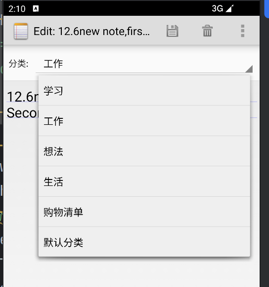  
（2）分类标签显示  
  
（3）分类筛选  
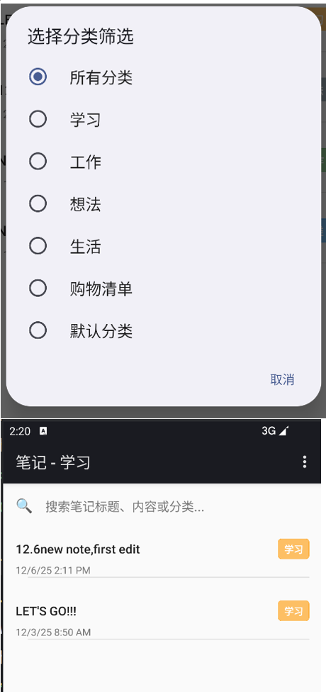  
（4）分类管理  
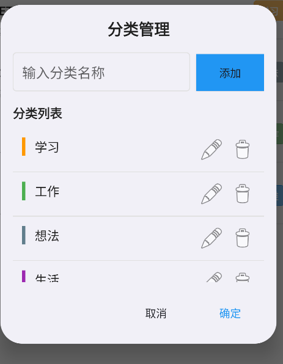  
### （二）笔记便签（桌面小部件）
#### 1. 功能要求
桌面小部件：在手机桌面显示笔记便签小部件  
快速查看：无需打开应用即可查看笔记内容  
快捷操作：点击便签直接打开对应笔记编辑界面  
多便签支持：支持创建多个便签显示不同笔记  
#### 2.实现思路与技术实现
(1) 小部件提供器 - NoteWidgetProvider.java  
继承AppWidgetProvider实现小部件基本功能：  
```java
public class NoteWidgetProvider extends AppWidgetProvider {
    private static final String TAG = "NoteWidgetProvider";
    
    @Override
    public void onUpdate(Context context, AppWidgetManager appWidgetManager, int[] appWidgetIds) {
        for (int appWidgetId : appWidgetIds) {
            updateAppWidget(context, appWidgetManager, appWidgetId);
        }
    }
    
    static void updateAppWidget(Context context, AppWidgetManager appWidgetManager, int appWidgetId) {
        // 获取小部件配置中存储的笔记ID
        int noteId = NoteWidgetConfigureActivity.loadNoteIdPref(context, appWidgetId);
        
        RemoteViews views = new RemoteViews(context.getPackageName(), R.layout.widget_layout);
        
        if (noteId == -1) {
            // 未配置笔记，显示提示
            views.setTextViewText(R.id.widget_title, "点击配置便签");
            views.setTextViewText(R.id.widget_content, "选择要显示的笔记");
        } else {
            // 查询笔记数据
            Uri noteUri = ContentUris.withAppendedId(NotePad.Notes.CONTENT_URI, noteId);
            Cursor cursor = context.getContentResolver().query(
                noteUri,
                new String[] {
                    NotePad.Notes.COLUMN_NAME_TITLE,
                    NotePad.Notes.COLUMN_NAME_NOTE,
                    NotePad.Notes.COLUMN_NAME_MODIFICATION_DATE,
                    NotePad.Notes.COLUMN_NAME_CATEGORY
                },
                null, null, null
            );
            
            if (cursor != null && cursor.moveToFirst()) {
                // 获取笔记数据并设置到小部件
                String title = cursor.getString(0);
                String content = cursor.getString(1);
                long modificationDate = cursor.getLong(2);
                String category = cursor.getString(3);
                
                // 格式化显示内容
                String displayContent = content;
                if (displayContent != null && displayContent.length() > 100) {
                    displayContent = displayContent.substring(0, 100) + "...";
                }
                
                views.setTextViewText(R.id.widget_title, title != null ? title : "无标题");
                views.setTextViewText(R.id.widget_content, displayContent != null ? displayContent : "无内容");
                views.setTextViewText(R.id.widget_category, category != null ? category : "默认分类");
                views.setTextViewText(R.id.widget_date, formatTimestamp(modificationDate));
                
                cursor.close();
            }
            
            // 设置点击打开笔记编辑界面
            Intent intent = new Intent(context, NoteEditor.class);
            intent.setAction(Intent.ACTION_EDIT);
            intent.setData(noteUri);
            PendingIntent pendingIntent = PendingIntent.getActivity(
                context, appWidgetId, intent,
                PendingIntent.FLAG_UPDATE_CURRENT | PendingIntent.FLAG_IMMUTABLE
            );
            views.setOnClickPendingIntent(R.id.widget_root, pendingIntent);
        }
        
        appWidgetManager.updateAppWidget(appWidgetId, views);
    }
}
```
(2) 小部件布局 - widget_layout.xml  
设计便签小部件的界面布局：  
```xml
<LinearLayout xmlns:android="http://schemas.android.com/apk/res/android"
    android:id="@+id/widget_root"
    android:layout_width="match_parent"
    android:layout_height="match_parent"
    android:orientation="vertical"
    android:background="@drawable/widget_background"
    android:padding="12dp">

    <!-- 分类标签 -->
    <TextView
        android:id="@+id/widget_category"
        android:layout_width="wrap_content"
        android:layout_height="wrap_content"
        android:textSize="12sp"
        android:textColor="@color/colorPrimary"
        android:textStyle="bold"
        android:background="@drawable/category_label_background"
        android:padding="2dp 8dp"
        android:layout_marginBottom="4dp" />

    <!-- 笔记标题 -->
    <TextView
        android:id="@+id/widget_title"
        android:layout_width="match_parent"
        android:layout_height="wrap_content"
        android:textColor="@color/text_primary"
        android:textSize="16sp"
        android:textStyle="bold"
        android:singleLine="true"
        android:ellipsize="end"
        android:layout_marginBottom="4dp" />

    <!-- 笔记内容 -->
    <TextView
        android:id="@+id/widget_content"
        android:layout_width="match_parent"
        android:layout_height="0dp"
        android:layout_weight="1"
        android:textColor="@color/text_secondary"
        android:textSize="14sp"
        android:maxLines="3"
        android:ellipsize="end"
        android:layout_marginBottom="4dp" />

    <!-- 修改时间 -->
    <TextView
        android:id="@+id/widget_date"
        android:layout_width="match_parent"
        android:layout_height="wrap_content"
        android:textColor="@color/text_hint"
        android:textSize="12sp"
        android:singleLine="true"
        android:ellipsize="end" />

</LinearLayout>
```
(3) 小部件配置界面 - NoteWidgetConfigureActivity.java  
提供小部件配置界面，选择要显示的笔记：  
```java
public class NoteWidgetConfigureActivity extends Activity {
    int mAppWidgetId = AppWidgetManager.INVALID_APPWIDGET_ID;
    ListView mNotesListView;
    
    @Override
    public void onCreate(Bundle savedInstanceState) {
        super.onCreate(savedInstanceState);
        setContentView(R.layout.widget_configure);
        
        mNotesListView = findViewById(R.id.notes_list);
        
        // 获取小部件ID
        Intent intent = getIntent();
        Bundle extras = intent.getExtras();
        if (extras != null) {
            mAppWidgetId = extras.getInt(AppWidgetManager.EXTRA_APPWIDGET_ID);
        }
        
        // 加载笔记列表
        loadNotesList();
        
        // 设置列表点击事件
        mNotesListView.setOnItemClickListener(new AdapterView.OnItemClickListener() {
            @Override
            public void onItemClick(AdapterView<?> parent, View view, int position, long id) {
                // 保存选择的笔记ID
                saveNoteIdPref(NoteWidgetConfigureActivity.this, mAppWidgetId, (int) id);
                
                // 更新小部件
                AppWidgetManager appWidgetManager = AppWidgetManager.getInstance(NoteWidgetConfigureActivity.this);
                NoteWidgetProvider.updateAppWidget(NoteWidgetConfigureActivity.this, appWidgetManager, mAppWidgetId);
                
                // 设置结果为OK
                Intent resultValue = new Intent();
                resultValue.putExtra(AppWidgetManager.EXTRA_APPWIDGET_ID, mAppWidgetId);
                setResult(RESULT_OK, resultValue);
                
                finish();
            }
        });
    }
    
    // 保存笔记ID到SharedPreferences
    static void saveNoteIdPref(Context context, int appWidgetId, int noteId) {
        SharedPreferences.Editor prefs = context.getSharedPreferences("NoteWidgetPrefs", 0).edit();
        prefs.putInt("widget_" + appWidgetId, noteId);
        prefs.apply();
    }
    
    // 从SharedPreferences读取笔记ID
    static int loadNoteIdPref(Context context, int appWidgetId) {
        SharedPreferences prefs = context.getSharedPreferences("NoteWidgetPrefs", 0);
        return prefs.getInt("widget_" + appWidgetId, -1);
    }
}
```
(4) AndroidManifest.xml配置  
注册小部件提供器和配置Activity：  
```xml
<receiver android:name=".NoteWidgetProvider"
    android:label="@string/appwidget_name">
    <intent-filter>
        <action android:name="android.appwidget.action.APPWIDGET_UPDATE" />
    </intent-filter>
    <meta-data
        android:name="android.appwidget.provider"
        android:resource="@xml/widget_info" />
</receiver>

<activity android:name=".NoteWidgetConfigureActivity">
    <intent-filter>
        <action android:name="android.appwidget.action.APPWIDGET_CONFIGURE" />
    </intent-filter>
</activity>
```
(5) 小部件信息配置 - widget_info.xml  
定义小部件的属性：  
```xml
<appwidget-provider xmlns:android="http://schemas.android.com/apk/res/android"
    android:minWidth="180dp"
    android:minHeight="110dp"
    android:updatePeriodMillis="86400000"
    android:initialLayout="@layout/widget_layout"
    android:configure="com.example.android.notepad.NoteWidgetConfigureActivity"
    android:resizeMode="horizontal|vertical"
    android:widgetCategory="home_screen" />
```

#### 3.实现效果界面截图
（1）桌面便签小部件    
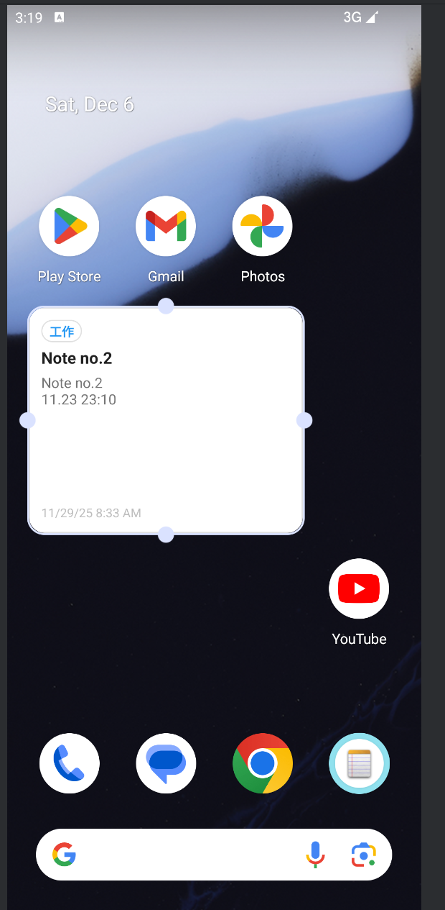  
（2）便签配置界面  
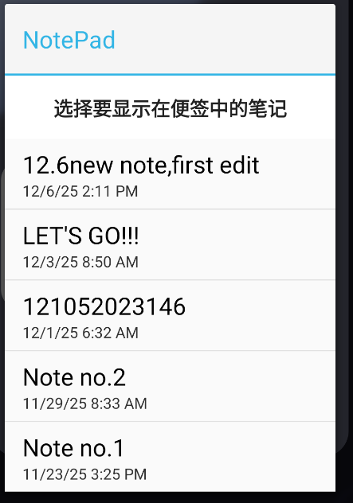  
